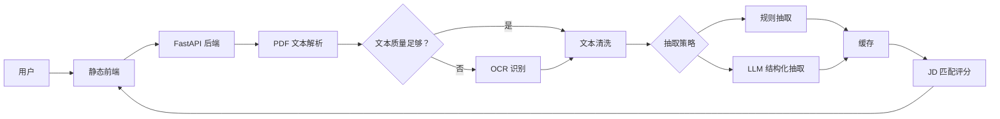

# AI Resume Analyzer

AI Resume Analyzer 是一个面向招聘筛选场景的简历解析与岗位匹配工具。项目当前形态是一个轻量但可运行的全栈原型：前端为纯静态页面，后端使用 FastAPI 提供 PDF 简历解析、结构化信息抽取、JD 匹配评分、缓存与接口幂等能力。

线上静态页面：<https://drktcoke.github.io/AI-Resume-Analyzer/>

## 项目能力

- PDF 简历上传与文本解析。
- 低质量 PDF 文本自动触发 OCR 回退，适配扫描件简历。
- 规则抽取默认可用，可选接入 OpenAI 或阿里云百炼兼容接口做 LLM 结构化抽取。
- 根据 JD 和简历内容输出匹配分，评分维度包括关键词、经验、学历和求职意向。
- 可选 Redis 缓存；未配置 Redis 时自动使用进程内存缓存。
- 上传与匹配接口支持幂等控制，减少重复解析、重复 OCR、重复 LLM 调用。
- 统一错误响应、`X-Request-ID` 链路追踪、CORS 配置和健康检查。

## 技术栈

| 层级 | 技术 |
| --- | --- |
| 前端 | HTML / CSS / JavaScript 静态页面 |
| 后端 | Python / FastAPI / Pydantic |
| PDF 解析 | pypdf |
| OCR | pypdfium2 / pytesseract / Pillow |
| LLM 调用 | httpx，兼容 OpenAI 风格接口 |
| 缓存 | Redis，可回退内存缓存 |
| 测试 | pytest / FastAPI TestClient |
| 部署 | 本地 uvicorn；后端可部署到阿里云函数计算 |

## 架构概览



后端主流程：

1. `POST /api/resume/upload` 接收 PDF。
2. 对文件内容计算 SHA-256 指纹，用于重复上传去重。
3. 使用 `pypdf` 抽取文本。
4. 如果文本质量较低且开启 OCR，则使用 OCR 回退。
5. 清洗文本并执行规则抽取或 LLM 抽取。
6. 缓存解析结果，返回 `resume_id`。
7. `POST /api/job/match` 根据 `resume_id` 和 JD 文本计算匹配评分。

## 目录结构

```text
.
├── backend/
│   ├── app/
│   │   ├── main.py                  # FastAPI 入口与接口层
│   │   ├── api_errors.py            # 统一错误响应
│   │   ├── config.py                # 环境配置
│   │   ├── schemas.py               # Pydantic 数据模型
│   │   └── services/
│   │       ├── cache.py             # Redis/内存缓存封装
│   │       ├── idempotency.py       # 幂等控制
│   │       ├── extractor.py         # 规则抽取
│   │       ├── llm_extractor.py     # LLM 抽取
│   │       ├── matcher.py           # JD 匹配评分
│   │       ├── ocr.py               # OCR 识别
│   │       ├── pdf_parser.py        # PDF 文本解析
│   │       └── text_processor.py    # 文本清洗与质量判断
│   ├── tests/                       # 单元测试与接口测试
│   ├── requirements.txt
│   └── s.yaml                       # Serverless Devs 部署配置
├── frontend/                        # 静态前端
└── docs/                            # API、架构、部署补充文档
```

## 本地启动

后端：

```bash
cd backend
python -m venv .venv
source .venv/bin/activate
pip install -r requirements.txt
cp .env.openai.example .env
uvicorn app.main:app --reload --port 8000
```

Windows PowerShell 可使用：

```powershell
cd backend
python -m venv .venv
.\.venv\Scripts\Activate.ps1
pip install -r requirements.txt
Copy-Item .env.openai.example .env
uvicorn app.main:app --reload --port 8000
```

前端：

```bash
cd frontend
python -m http.server 8080
```

打开 `http://localhost:8080`，将页面中的 API Base URL 设置为 `http://localhost:8000`。

## 配置说明

后端配置来自 `backend/.env`，可以从 `backend/.env.example` 或 `backend/.env.openai.example` 复制。

| 配置项 | 默认值 | 说明 |
| --- | --- | --- |
| `APP_NAME` | `AI Resume Analyzer` | FastAPI 应用名称 |
| `REDIS_URL` | 空 | Redis 地址；为空时使用内存缓存 |
| `ENABLE_LLM` | `false` | 是否启用 LLM 抽取 |
| `LLM_PROVIDER` | `openai` | LLM 供应商标记，可用 `openai` / `bailian` |
| `LLM_API_KEY` | 空 | LLM API Key |
| `LLM_BASE_URL` | `https://api.openai.com` | OpenAI 兼容接口地址 |
| `LLM_MODEL` | `gpt-4o-mini` | 模型名称 |
| `ENABLE_OCR` | `true` | 是否启用 OCR 回退 |
| `OCR_DPI` | `220` | OCR 渲染 DPI |
| `OCR_MAX_PAGES` | `3` | OCR 最大处理页数 |
| `MAX_UPLOAD_BYTES` | `10485760` | PDF 上传大小限制，默认 10MB |
| `IDEMPOTENCY_TTL_SECONDS` | `86400` | 幂等记录保留时间 |
| `IDEMPOTENCY_KEY_MAX_LENGTH` | `128` | 幂等键最大长度 |
| `CORS_ALLOW_ORIGINS` | `*` | 允许的跨域来源，多个值用逗号分隔 |

OCR 依赖系统安装 `tesseract`。如果本地或部署环境没有安装，建议先设置：

```env
ENABLE_OCR=false
```

## API 概览

| 方法 | 路径 | 说明 |
| --- | --- | --- |
| `GET` | `/healthz` | 健康检查，返回服务和缓存状态 |
| `POST` | `/api/resume/upload` | 上传 PDF 并解析简历 |
| `GET` | `/api/resume/{resume_id}` | 查询简历解析结果 |
| `POST` | `/api/job/match` | 根据简历和 JD 返回匹配评分 |

所有响应都会带 `X-Request-ID`。客户端也可以主动传入 `X-Request-ID`，便于排查一次请求链路。

错误响应统一为：

```json
{
  "error": {
    "code": "not_found",
    "message": "Resume not found",
    "request_id": "trace-id"
  }
}
```

幂等控制：

- `POST /api/resume/upload` 和 `POST /api/job/match` 支持可选请求头 `Idempotency-Key`。
- 同一个幂等键只能对应同一个请求内容；同 key 不同内容会返回 `409`。
- 幂等回放或缓存命中时，响应头包含 `Idempotency-Replayed: true`。
- 未传幂等键时，上传接口仍会按 PDF 内容哈希去重，匹配接口会按 `resume_id + jd_text` 复用结果。

完整接口示例见 [docs/api.md](docs/api.md)。

## 匹配评分

当前评分策略是稳定、可解释的规则模型：

```text
total = 0.55 * keyword + 0.25 * experience + 0.1 * education + 0.1 * intent
```

- `keyword`：JD 关键词命中率。
- `experience`：简历经验年限与 JD 要求年限对比，封顶 1.0。
- `education`：按大专、本科、硕士、博士做等级比较。
- `intent`：求职意向与 JD 关键词的相关性。

这套规则适合原型验证和可解释展示，后续可以引入更细的岗位技能词库、向量召回或学习排序模型。

## 测试

```bash
cd backend
pytest
```

当前测试覆盖：

- 规则抽取和文本质量判断。
- LLM 响应 JSON 提取。
- JD 匹配评分。
- 上传/匹配接口幂等与缓存复用。
- 请求校验、统一错误响应、`X-Request-ID` 和幂等回放响应头。

## 部署

后端可用 uvicorn 常驻进程部署，也可以通过 `backend/s.yaml` 部署到阿里云函数计算：

```bash
cd backend
s deploy
```

部署注意事项：

- 如果开启 OCR，运行环境需要安装 `tesseract` 和中文语言包。
- 如果开启 LLM，需要配置真实的 `LLM_API_KEY`。
- 生产环境建议配置 Redis，避免进程重启后缓存和幂等记录丢失。
- 生产环境建议将 `CORS_ALLOW_ORIGINS` 设置为明确域名，而不是 `*`。

更多部署细节见 [docs/deploy.md](docs/deploy.md)。

## 当前边界与后续路线

当前项目已经具备基础可用的接口层，但仍是轻量原型，不是完整 ATS 系统。

建议后续优先迭代：

- 将 PDF 解析、OCR、LLM 抽取拆成异步任务，上传后返回 `task_id`，前端轮询状态。
- 增加请求限流和上传频率控制，避免昂贵的 OCR/LLM 被滥用。
- 增加持久化数据库，保存简历、岗位、匹配历史和用户操作。
- 完善前端交互，包括上传进度、错误提示、历史记录和结果对比。
- 为 LLM 抽取增加 schema 重试和结构化校验，提升复杂简历的稳定性。
